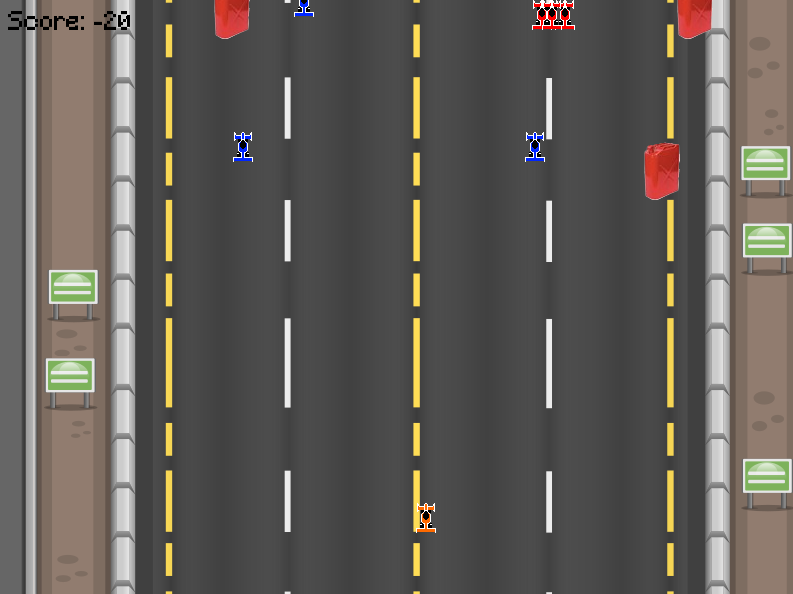

# Turbo Racing
Descripción del Juego de Carreras

El juego es un simulador de carreras en tercera persona. El jugador controla un auto que puede moverse de izquierda a derecha para evitar obstáculos y recolectar bidones de gasolina. Hay tres tipos de obstáculos:

      Bidones de gasolina: sumarán 20 puntos al puntaje cada vez que los toques.
      Carros azules: restarán 20 puntos al puntaje si los chocas.
      Carros rojos: te harán perder la partida al chocar con ellos.
Cuando pierdes, aparecerá un mensaje de "Game Over" y podrás reiniciar la partida presionando la tecla R.                                      

                                        ¡Buena suerte en tu carrera!

Estructura del Juego
Clases Principales
Carro (Jugador)

Propiedades:
sprite: Un objeto sf::Sprite que representa la imagen del coche del jugador.
x: La posición horizontal del coche en la pantalla.
speed: La velocidad a la que se mueve el coche.
Métodos:
moveLeft(): Mueve el coche a la izquierda.
moveRight(): Mueve el coche a la derecha.
resetPosition(): Restaura la posición del coche al centro de la pantalla.
Objeto (Obstáculos)

Propiedades:
sprite: Un objeto sf::Sprite que representa la imagen de un objeto (por ejemplo, bidones o coches).
speed: La velocidad a la que el objeto cae (se mueve hacia abajo).
Métodos:
update(): Mueve el objeto hacia abajo en la pantalla y lo reinicia a una posición aleatoria si ha salido de la pantalla.
Contador de tiempo

Método:
showCountdown(): Muestra una cuenta regresiva al inicio del juego antes de que comience la acción.
Carretera

La carretera está representada por dos sprites que se mueven hacia abajo para simular el movimiento del vehículo del jugador a lo largo de la carretera.
Se maneja el movimiento de los coches y objetos en la pantalla.
Los coches rojos (enemigos) se generan en intervalos de tiempo y se mueven hacia abajo.
Interacción con Obstáculos

El jugador gana puntos al recoger bidones verdes (greenBarrels) y pierde puntos al recoger bidones azules (blueBarrels).
El juego termina si el jugador colisiona con un coche rojo (redCar).
Flujo del Juego
Inicio del Juego:

El juego comienza con una cuenta regresiva que muestra "3", "2", "1" y luego "Ready Go!".
Luego de la cuenta regresiva, el jugador puede mover su coche utilizando las teclas de flecha izquierda y derecha.
Movimiento del Jugador:

El coche del jugador se mueve a lo largo de la pantalla, pero se limita dentro de unos bordes predefinidos (X entre 118 y 670).

@startuml

class Carro {
    - sf::Sprite sprite
    - float x
    - float speed
    + Carro(const sf::Texture& texture, float startX, float startY, float speed)
    + void moveLeft(float deltaTime)
    + void moveRight(float deltaTime)
    + const sf::Sprite& getSprite() const
    + void resetPosition()
}

class Objeto {
    - sf::Sprite sprite
    - float speed
    + Objeto(const sf::Texture& texture, float startX, float startY, float speed)
    + void update(float deltaTime)
    + const sf::Sprite& getSprite() const
    + void resetPosition()
}

class Juego {
    - int intervaloGeneracion
    - std::chrono::steady_clock::time_point lastGenerationTime
    - std::vector<Azul> carros
    + Juego()
    + void generarCarro()
    + void moverCarros()
    + void controlarGeneracion()
    + void dibujarCarros()
    + int generarPosicionAleatoriaX()
    + void ejecutar()
}

class Carretera {
    - bool gameOver
    - Carro playerCar
    - std::vector<Rojo> redCars
    + Carretera()
    + void movePlayerLeft(float delta)
    + void movePlayerRight(float delta)
    + int getPlayerX() const
    + void checkCollision()
    + void update(sf::Vector2u windowSize, float deltatime)
    + Rojo& getRedCar()
    + void startGame(sf::RenderWindow &window, sf::Font &font)
    + bool isGameOver() const
    + void mover(float velocidad, bool juegoActivo)
}

class Azul {
    - int x
    - int y
    + Azul()
    + int getX() const
    + int getY() const
    + void setPosition(int xPos, int yPos)
}

class Bidon {
    - int x
    - int y
    + Bidon()
    + int getX() const
    + int getY() const
    + void setPosition(int xPos, int yPos)
    + void updatePosition(float deltaTime)
}

class Rojo {
    - int x
    - int y
    + Rojo()
    + void setPosition(int xPos, int yPos)
    + void updatePosition(float deltaTime)
}

Carro --> Carretera : uses
Carretera --> Rojo : manages
Carretera --> Bidon : manages
Carretera --> Azul : manages
Carro --> Objeto : interacts

@enduml

El proyecto esta desarrollado sobre MinGW64 utilizando Msys2
y como editor se esta utilizando Visual Studio Code

## Como ejecutar el juego:

Instalar todas las dependencias descritas abajo y dentro de una terminal de vscode ejecutar:

> make run

## Programas necesarios

### Visual estudio code
Descargar e instalar vscode en el siguiente [Enlace.](https://code.visualstudio.com/)

### MSYS2 (Windows)

Instalar Msys2 usando el siguiente [Enlace.](https://github.com/msys2/msys2-installer/releases/download/2023-05-26/msys2-x86_64-20230526.exe)

No modificar ningua opcion al momento de intalacion o podrian variar las configuraciones.

Una vez instalado es necesario agregar los siguientes directorios al path de windows y reiniciar.

> C:\msys64\mingw64\bin

> C:\msys64\usr\bin

### Github Desktop
Cliente de escritorio para clonar el repositorio, descargar usando el siguiente [enlace](https://desktop.github.com/).

### Git
Para poder realizar commits de vscode es necesario tener instalado Git, descargarlo del siguiente [enlace](https://git-scm.com/).

## Complementos necesarios VSCode

- Material Icon
- C/C++
- PlantUML
- GitGraph

